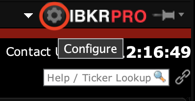
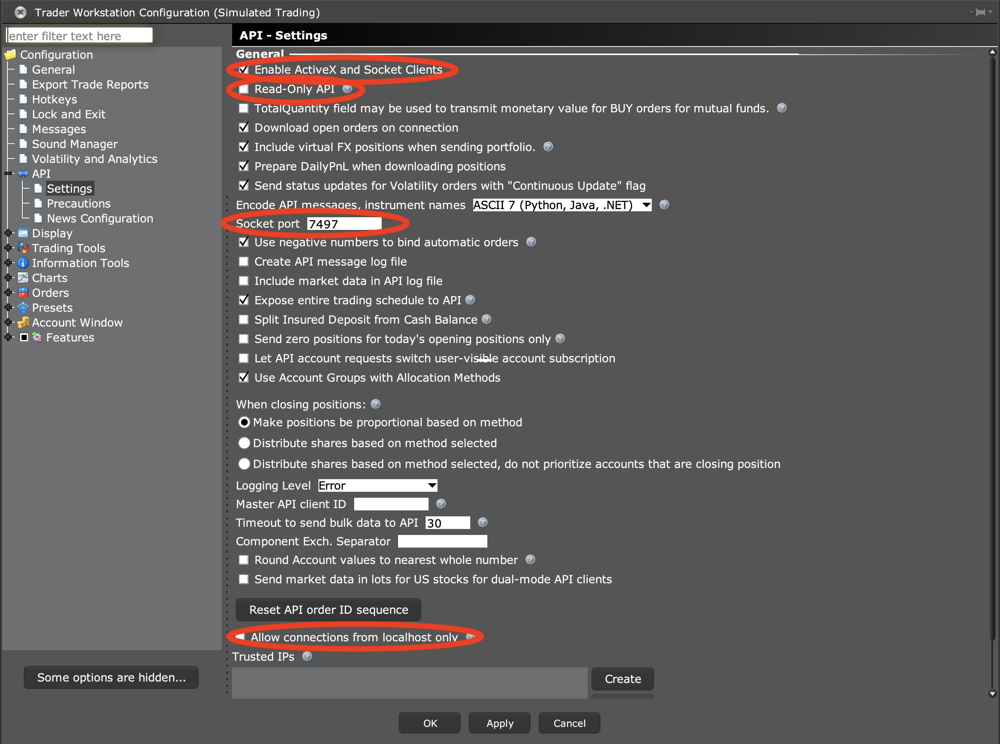
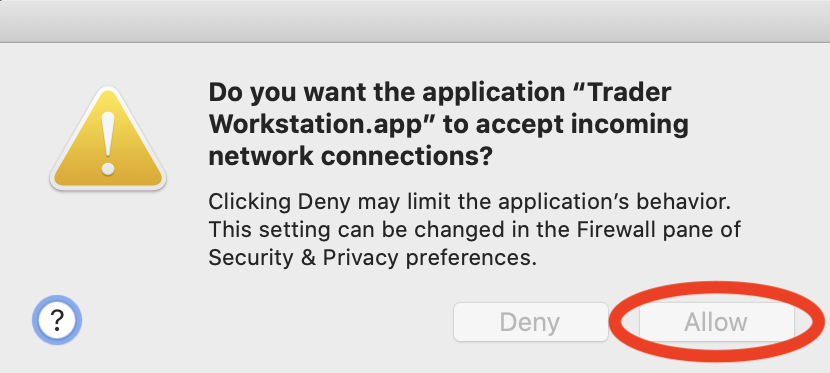

# deephaven-ib

<!-- TODO: add an imagge -->

An Interactive Brokers integration for Deephaven.


# Run deephaven-ib

Follow these setps to run a [Deephaven](https://deephaven.io) plus [Interactive Brokers](https://interactivebrokers.com) system. 

`<deephaven_version>` is the version of [Deephaven](https://deephaven.io) to run (e.g. `0.9.0`).  A list of availble versions 
can be found on the [Deephaven Releases GitHub page](https://github.com/deephaven/deephaven-core/releases).

**Windows users need to run the commands in WSL.**

## Setup
To setup and configure the system:

1) Follow the [Deephaven Quick Start Guide](https://deephaven.io/core/docs/tutorials/quickstart/) to get [Deephaven](https://deephaven.io) running.  
1) Follow the [TWS Installation Instructions](https://www.interactivebrokers.com/en/trading/tws.php) to get [IB Trader Workstation (TWS)](https://www.interactivebrokers.com/en/trading/tws.php) running.
1) Check out the [deephaven-ib](https://github.com/deephaven-examples/deephaven-ib) repository:
    ```bash
    git clone https://github.com/deephaven-examples/deephaven-ib.git
    cd deephaven-ib
    ```
1) Launch [IB Trader Workstation (TWS)](https://www.interactivebrokers.com/en/trading/tws.php).
1) In [IB Trader Workstation (TWS)](https://www.interactivebrokers.com/en/trading/tws.php), click on the gear in the
upper right corner.    
  In API->Settings, make sure:

    * "Enable ActiveX and Socket Clients" is selected.
    * "Allow connections from localhost only" is not selected.
    * "Read-Only API" is selected if you want to prevent trade submission from [deephaven-ib](https://github.com/deephaven-examples/deephaven-ib).  
        
    Also, note the "Socket port" value.  It is needed when connecting [deephaven-ib](https://github.com/deephaven-examples/deephaven-ib).
    

## Launch
To launch the system:

1) Launch [IB Trader Workstation (TWS)](https://www.interactivebrokers.com/en/trading/tws.php).
1) Accept incoming connections to [IB Trader Workstation (TWS)](https://www.interactivebrokers.com/en/trading/tws.php).

1) Build the Docker images:
    ```bash
    ./docker/deephaven_ib_docker.sh build --dh-version <deephaven_version>
    ```
1) Launch the system:
    ```bash
    ./docker/deephaven_ib_docker.sh up --dh-version <deephaven_version>
    ```
1) Launch the [Deephaven IDE](https://github.com/deephaven/deephaven-core/blob/main/README.md#run-deephaven-ide) by navigating to [http://localhost:10000/ide/](http://localhost:10000/ide/) in a browser.

## Shutdown
To shut down the system:
```bash
./docker/deephaven_ib_docker.sh down --dh-version <deephaven_version>
```

## Help
To get help on running the system:
```bash
./docker/deephaven_ib_docker.sh help
```

# Use deephaven-ib

## Connect to TWS

All [deephaven-ib](https://github.com/deephaven-examples/deephaven-ib) sessions need to first create a client for interacting 
with [IB Trader Workstation (TWS)](https://www.interactivebrokers.com/en/trading/tws.php).

`host` is the computer to connect to.  When using [deephaven-ib](https://github.com/deephaven-examples/deephaven-ib) inside
of Docker, `host` should be set to `host.docker.internal`.  

`port` is the network port [IB Trader Workstation (TWS)](https://www.interactivebrokers.com/en/trading/tws.php)
communicates on.  This value can be found in the [IB Trader Workstation (TWS)](https://www.interactivebrokers.com/en/trading/tws.php)
settings.  By default, production trading uses port 7496, and paper trading uses port 7497.  See [Setup](#setup) and [TWS Initial Setup](https://interactivebrokers.github.io/tws-api/initial_setup.html) for more details.

```python
import deephaven_ib as dhib

client = dhib.IbSessionTws(host="host.docker.internal", port=7496)
client.connect()
```

## Get data

[deephaven-ib](https://github.com/deephaven-examples/deephaven-ib) stores all [IB Trader Workstation (TWS)](https://www.interactivebrokers.com/en/trading/tws.php)
data as dynamically updating [Deephaven](https://deephaven.io) tables.  [Deephaven](https://deephaven.io)
tables are extremely powerful and can express very complex logic concisely.
For more details on [Deephaven](https://deephaven.io), see the [Deephaven Documentation](https://deephaven.io/core/docs/).  

The [deephaven-ib](https://github.com/deephaven-examples/deephaven-ib) client contains two dictionaries of tables:
* `tables` contains the tables most users will want.  
* `tables_raw` contains raw [IB Trader Workstation (TWS)](https://www.interactivebrokers.com/en/trading/tws.php)
data.

As an example, the `requests` table, that contains all of the requests made to [IB Trader Workstation (TWS)](https://www.interactivebrokers.com/en/trading/tws.php),
can be obtained by:

```python
requests = client.tables["requests"]
```

To display all of the tables in the [Deephaven IDE](https://github.com/deephaven/deephaven-core/blob/main/README.md#run-deephaven-ide),
place the tables in the global namespace.  This can most easily be done by:

```python
for k, v in client.tables.items():
    globals()[k] = v
```

Similarly, raw tables can be viewed by:

```python
for k, v in client.tables_raw.items():
    globals()[k] = v
```

A list of available tables can be obtained by:

```python
print(client.tables.keys())
print(client.tables_raw.keys())
```

## Create a contract

In IB, financial contracts include:
* Stocks
* FX
* Cryptocurrency
* Indexes
* CFDs
* Futures
* Options
* Futures Options
* Bonds
* Mutual Funds
* Warrants
* Commodities

To create a contract for use in [deephaven-ib](https://github.com/deephaven-examples/deephaven-ib),
the contract must first be created as an `ibapi.contract.Contract`.  Once the contract is created,
it must be registered with [deephaven-ib](https://github.com/deephaven-examples/deephaven-ib) before it
can be used.  

Details on creating contracts can be found at 
[https://interactivebrokers.github.io/tws-api/basic_contracts.html](https://interactivebrokers.github.io/tws-api/basic_contracts.html).

Registering the contract causes the contract details to appear in the `contracts_details` table.

```python
from ibapi.contract import Contract

c = Contract()
c.symbol = 'AAPL'
c.secType = 'STK'
c.exchange = 'SMART'
c.currency = 'USD'

rc = client.get_registered_contract(c)
print(rc)
```

[./examples/example_all_functionality.py](./examples/example_all_functionality.py) illustrates the creation and registration
of many different types of contracts.

## Request market data

Market data can be requested from the client using:
* `request_market_data`
* `request_bars_historical`
* `request_bars_realtime`
* `request_tick_data_realtime`
* `request_tick_data_historical`

```python
from ibapi.contract import Contract

import deephaven_ib as dhib

# Use delayed market data if you do not have access to real-time
# client.set_market_data_type(dhib.MarketDataType.DELAYED)
client.set_market_data_type(dhib.MarketDataType.REAL_TIME)


c = Contract()
c.symbol = 'AAPL'
c.secType = 'STK'
c.exchange = 'SMART'
c.currency = 'USD'

rc = client.get_registered_contract(c)
print(rc)

client.request_market_data(rc)
client.request_tick_data_realtime(rc, dhib.TickDataType.BID_ASK)
client.request_tick_data_realtime(rc, dhib.TickDataType.LAST)
client.request_tick_data_realtime(rc, dhib.TickDataType.MIDPOINT)
```

[./examples/example_all_functionality.py](./examples/example_all_functionality.py) illustrates requesting
many kinds of market data.


## Request news

Market data can be requested from the client using:
* `request_news_historical`
* `request_news_article`

```python
from ibapi.contract import Contract

from deephaven import DateTimeUtils as dtu

contract = Contract()
contract.symbol = "GOOG"
contract.secType = "STK"
contract.currency = "USD"
contract.exchange = "SMART"

rc = client.get_registered_contract(contract)
print(contract)

start = dtu.convertDateTime("2021-01-01T00:00:00 NY")
end = dtu.convertDateTime("2021-01-10T00:00:00 NY")
client.request_news_historical(rc, start=start, end=end)

client.request_news_article(provider_code="BRFUPDN", article_id="BRFUPDN$107d53ea")
```

[./examples/example_all_functionality.py](./examples/example_all_functionality.py) illustrates requesting
news data.

## Request account details

Standard account details are requested by default.  [IB Trader Workstation (TWS)](https://www.interactivebrokers.com/en/trading/tws.php)
does not provide an API for requesting all model codes, so [deephaven-ib](https://github.com/deephaven-examples/deephaven-ib)
can not subscribe to data for different model codes.  If you need details on non-standard
account / model code combinations, you can use:
* `request_account_pnl`
* `request_account_overview`
* `request_account_positions`

## Order management

Orders can be created and canceled using:
* `order_place`
* `order_cancel`
* `order_cancel_all`

To place an order, register a contract with [deephaven-ib](https://github.com/deephaven-examples/deephaven-ib),
and create an `ibapi.order.Order` containing details for the order.

Details on creating orders can be found at [https://interactivebrokers.github.io/tws-api/orders.html](https://interactivebrokers.github.io/tws-api/orders.html).

```python
from ibapi.contract import Contract
from ibapi.order import Order

contract = Contract()
contract.symbol = "GOOG"
contract.secType = "STK"
contract.currency = "USD"
contract.exchange = "SMART"

rc = client.get_registered_contract(contract)
print(contract)

order = Order()
order.account = "DF4943843"
order.action = "BUY"
order.orderType = "LIMIT"
order.totalQuantity = 1
order.lmtPrice = 3000
order.eTradeOnly = False
order.firmQuoteOnly = False

req = client.order_place(rc, order)
req.cancel()

client.order_place(rc, order)
client.order_cancel_all()
```

## Logging

[deephaven-ib](https://github.com/deephaven-examples/deephaven-ib) and `ibapi` both use Python's 
[`logging`](https://docs.python.org/3/howto/logging.html) framework.  By default, `ERROR` and higher
levels are logged.  More or less logging can be displayed by changing the logging level.

To see fewer log messages:
```python
import logging
logging.basicConfig(level=logging.CRITICAL)
```

To see all log messages:
```python
import logging
logging.basicConfig(level=logging.DEBUG)
```

A discussion of available logging levels can be found in the [Python `logging` module documentation](https://docs.python.org/3/howto/logging.html).

# Examples

Examples can be found in [./examples](./examples).
