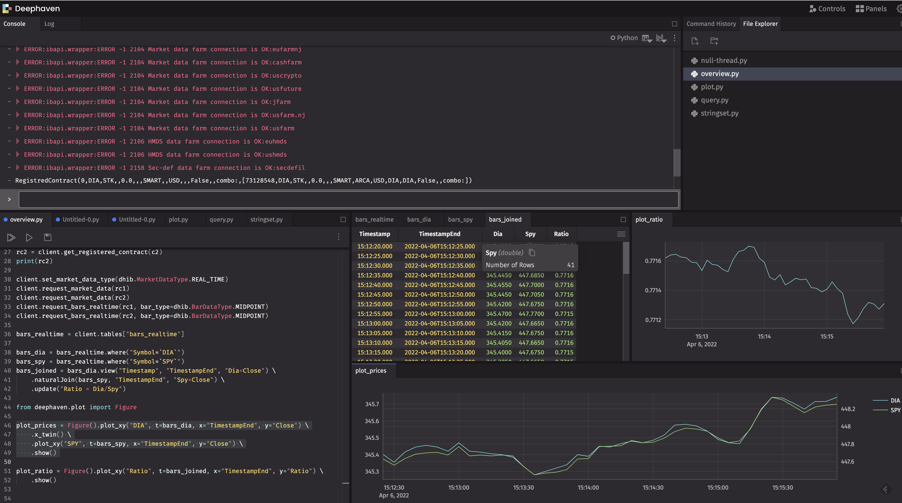

.. toctree::
   :name: mastertoc
   :hidden:

   modules.rst
   py-modindex.rst
   genindex.rst

deephaven_ib Documentation
==============================

This page documents the `deephaven_ib <https://github.com/deephaven-examples/deephaven-ib/>`_ API.

`deephaven-ib <https://github.com/deephaven-examples/deephaven-ib/>`_ is an `Interactive Brokers <https://www.interactivebrokers.com/>`_
integration for `Deephaven <https://deephaven.io>`_.

`Interactive Brokers <https://www.interactivebrokers.com/>`_ is a very popular brokerage in the quantitative finance world,
with about $200B of customer equity.  Quants and hedge funds often choose `Interactive Brokers <https://www.interactivebrokers.com/>`_
because of its low trading costs and API that facilitates automated trading.  With low minimum account balances,
it is also an attractive choice for individual investors.

`Deephaven <https://deephaven.io>`_ is the real-time query engine that runs the quantitative trading of the world's largest
hedge funds, banks, and exchanges.  `Deephaven <https://deephaven.io>`_ makes working with real-time data easy and
facilitates very concise and easy-to-read code.  With `Deephaven <https://deephaven.io>`_, quants can create new models
and get them into production quickly, traders can monitor the market and their portfolios, and
managers can monitor risk.

`deephaven-ib <https://github.com/deephaven-examples/deephaven-ib>`_ combines the low-cost trading of
`Interactive Brokers <https://www.interactivebrokers.com/>`_ with the analytical power and ease of use of
`Deephaven Community Core <https://github.com/deephaven/deephaven-core>`_ to yield an open, quantitative
trading platform.  Basically, it provides an open platform for building a quantitative hedge fund or for performing
quantitative trading in your personal account.

`deephaven-ib <https://github.com/deephaven-examples/deephaven-ib>`_ supports trading essentially all common
exchange traded products.  These include:

* Stocks
* Mutual Funds
* Options
* Futures
* Futures Options
* Indexes
* Bonds
* Foreign Exchange (Forex or FX)
* Cryptocurrency
* Contracts for Differences (CFDs)
* Warrants
* Commodities

See `https://github.com/deephaven-examples/deephaven-ib <https://github.com/deephaven-examples/deephaven-ib>`_ for
examples and details on using `deephaven-ib <https://github.com/deephaven-examples/deephaven-ib>`_.

